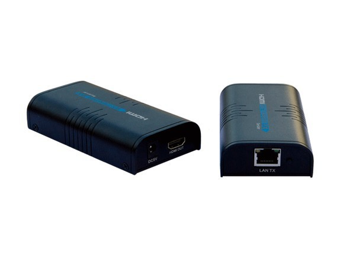

# hdmi-rip
Video/Audio ripper for HDMI IP network extender.

This code will take the output of a LENKENG HDMI over IP extender (Version 2.0) and save it to raw audio (signed 32 bit big-endian PCM) and MJPEG video (YUV 4:2:2).

The hardware can be bought cheaply on ebay by searching for 'HDMI Extender 120m', and the device should look like this:



Make sure it says "LAN/TX" on the CAT5 socket, not just TX as there are some models that do not use IP, but only a straight cable connection. Also, make sure it is the V2.0 model, not V3.

Despite the cheapness of the device, the video output is very high quality. This is because it is effectively dumping a frame buffer direct from HDMI and is using the YUV 4:2:2 Chroma scheme so there is very little noticeable degredation. The audio, on the other hand, is always transcoded to raw PCM Stereo, so you will lose any surround sound etc.

##Installation:

```

  sudo python ./setup.py install

```

##Usage:

```

  hdmi-rip.py [options] <file prefix> [minutes]

  Options:
    -h, --help            show this help message and exit
    -l LOCAL_IP, --local_ip=LOCAL_IP
                          use local IP address as source (0.0.0.0)
    -p SENDER_PORT, --sender_port=SENDER_PORT
                          set sender's UDP PORT (48689)
    -q, --quiet           don't print status messages to stdout (False)
    -s SENDER_IP, --sender_ip=SENDER_IP
                          set sender's IP address (192.168.168.55)
    -S, --strict          strict mode - abort recording if frames dropped

```

You will need to run as root to be able create the appropriate network sockets, and have a local IP address on the same network as the sender. You must also have a default route set in order to be able to join the multicast group.

##Example:

```

  sudo hdmi-rip.py /tmp/dummy 20

```

  Will produce /tmp/dummy-video.dat and /tmp/dummy-audio.dat and automatically stop after 20 minutes.

##Transcoding:

  I do this in two stages. The first synchronises the audio but leaves the video alone which speeds up processing. This output is then used for editing/trimming. Adjust the audio offset with '-itsoffset'

  For NTSC content no audio offset:

```

    ffmpeg -f mjpeg -r 29.97 -i /tmp/dummy-video.dat -itsoffset 0.0 -f s32be -ac 2 -ar 48000 -i /tmp/dummy-audio.dat -f matroska -vcodec copy -c:a libmp3lame -qscale:a 2  /tmp/dummy.mkv

```

  For PAL content, audio delayed by 0.2 seconds:

```

    ffmpeg -f mjpeg -r 25 -i /tmp/dummy-video.dat -itsoffset 0.2 -f s32be -ac 2 -ar 48000 -i /tmp/dummy-audio.dat -f matroska -vcodec copy -c:a libmp3lame -qscale:a 2  /tmp/dummy.mkv

```

  I use kdenlive to trim: add clip to project then select entry and exit points in clip monitor and right-click to 'extract zone' for a lossless edit.
  
  Once trimmed, transcode the video:

```

    ffmpeg -i /tmp/dummy.mkv -c:v mpeg4 -vtag xvid -qscale:v 2 -c:a copy /tmp/final.mkv

```

  The final output of a 720p capture of Big Buck Bunny, (c) copyright 2008, Blender Foundation / www.bigbuckbunny.org, can be viewed here: 

  <a href="http://rfidiot.org/hdmi-mjpeg/bb-rip-720-trimmed-final.mkv" target="_blank"></a>

##Tips & tricks:

  Reduce packet loss by using a direct connection instead of a switch (don't forget to set a dummy default route or you won't be able to join the multicast group).

  Seemingly unrelated actions like heavy load from other processes or even screensavers can cause packet loss.

  You may get a better soundtrack by switching your source to Stereo/PCM instead of allowing the transmitter to downscale.

  Adding a dual output HDMI splitter will allow you to monitor the source while setting up for recording. It also prevents auto-switching of HDMI settings sometimes caused by switching cables.

##Further development you could help with:

  - Add gstreamer pipelines for monitoring/streaming.

  - Add support for other senders.

  - Sanitise audio? (see below).

##Credits:

  This project was inspired by benjojo's blog: https://blog.benjojo.co.uk/post/cheap-hdmi-capture-for-linux which was in turn inspired by danman's blog: https://blog.danman.eu/reverse-engineering-lenkeng-hdmi-over-ip-extender/

  Original script by Silver Moon (m00n.silv3r@gmail.com) and danman.

  Framerates by Jared Earl. :)

##Notes:

  Video frames are buffered and discarded if any part of the frame is lost or received out of sequence. This is safe to do as the data is in MJPEG format so every frame is a complete image, and loss of one frame every now and then will not be noticeable. The same cannot be said for audio, and currently no attempt is made to sanitise the audio.

  The audio track is currently not tagged with its data rate, so you may need to experiment to decide what it is. The only format I've seen so far is 48KHz which gives the above video framerates for transcoding. If your soundtrack goes out of sync during playback then you've probably used the wrong one (despite being in the UK, a lot of streaming services are actually transmitted with NTSC framerates).

  HDCP is stripped by the hardware. Why this is not a surprise: http://adamsblog.aperturelabs.com/2013/02/hdcp-is-dead-long-live-hdcp-peek-into.html

